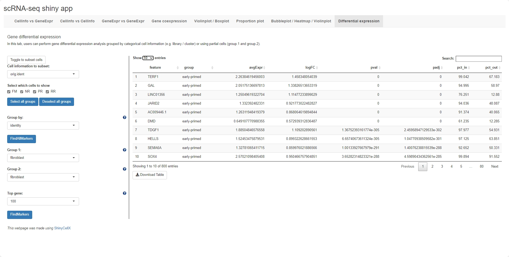

# Background
`ShinyCellX` is an evolution of [ShinyCell](https://github.com/SGDDNB/ShinyCell) designed to extend the functionality of ShinyCell. On the basis of ShinyCell, a differential expression analysis module has been added, the group drawing module has been optimised, and the user is able to adjust the order of the groups freely.

We also compared ShinyCellX with nine other popular scRNA-seq visualisation 
tools, which further highlights the key features of `ShinyCellX`. 


# Table of Contents and Additional Tutorials
This readme is broken down into the following sections:

- [Installation](#installation) on how to install `ShinyCell`

- [Quick Start Guide](#quick-start-guide) to rapidly deploy a shiny app with 
  a few lines of code

- [Frequently Asked Questions](#frequently-asked-questions)

There are also additional tutorials as follows:

- [Tutorial for customising ShinyCell aesthetics](
https://htmlpreview.github.io/?https://github.com/SGDDNB/ShinyCell/blob/master/docs/1aesthetics.html)

- [Tutorial for creating a ShinyCell app containing several single-cell datasets](
https://htmlpreview.github.io/?https://github.com/SGDDNB/ShinyCell/blob/master/docs/2multi.html)

- [Tutorial on other supported file formats (h5ad / loom / SCE)](
https://htmlpreview.github.io/?https://github.com/SGDDNB/ShinyCell/blob/master/docs/3otherformat.html)

- [Tutorial on processing plain-text gene expression matrices](
https://htmlpreview.github.io/?https://github.com/SGDDNB/ShinyCell/blob/master/docs/3plaintext.html)

- [Instructions on how to deploy ShinyCell apps online](
https://htmlpreview.github.io/?https://github.com/SGDDNB/ShinyCell/blob/master/docs/4cloud.html)


# Installation
First, users can run the following code to check if the packages required by 
`ShinyCellX` exist and install them if required:
``` r
reqPkg = c("shinyjqui","data.table", "Matrix", "hdf5r", "reticulate", "ggplot2", 
           "gridExtra", "glue", "readr", "RColorBrewer", "R.utils", "Seurat", "dplyr","rio")
newPkg = reqPkg[!(reqPkg %in% installed.packages()[,"Package"])]
if(length(newPkg)){install.packages(newPkg)}
devtools::install_github("immunogenomics/presto")

# If you are using h5ad file as input, run the code below as well
# reticulate::py_install("anndata")
```

Furthermore, on the system where the Shiny app will be deployed, users can run 
the following code to check if the packages required by the Shiny app exist 
and install them if required:
``` r
reqPkg = c("shiny", "shinyhelper", "shinyjqui", "data.table", "Matrix", "DT", "hdf5r", 
           "reticulate", "ggplot2", "gridExtra", "ggdendro", "dplyr","rio")
newPkg = reqPkg[!(reqPkg %in% installed.packages()[,"Package"])]
if(length(newPkg)){install.packages(newPkg)}
devtools::install_github("immunogenomics/presto")
```

`ShinyCell` can then be installed from GitHub as follows:
``` r
devtools::install_github("chenhy-lab/ShinyCellX")
```


# Quick Start Guide
In short, the `ShinyCell` package takes in an input single-cell object and 
generates a ShinyCell config `scConf` containing labelling and colour palette 
information for the single-cell metadata. The ShinyCell config and single-cell 
object are then used to generate the files and code required for the shiny app. 

In this example, we will use single-cell data (Seurat object) containing 
intermediates collected during the reprogramming of human fibroblast into 
induced pluripotent stem cells using the RSeT media condition, taken from 
[Liu, Ouyang, Rossello et al. Nature (2020)](
https://www.nature.com/articles/s41586-020-2734-6). The Seurat object can be 
[downloaded here](http://files.ddnetbio.com/hrpiFiles/readySeu_rset.rds).

A shiny app can then be quickly generated using the following code:
 
``` r
library(Seurat)
library(ShinyCellX)

getExampleData()                       # Download example dataset (~200 MB)
seu = readRDS("readySeu_rset.rds")
seu = UpdateSeuratObject(seu)
scConf = createConfig(seu)
makeShinyApp(seu, scConf, gene.mapping = TRUE,
             shiny.title = "ShinyCell Quick Start") 
```

The generated shiny app can then be found in the `shinyApp/` folder (which is 
the default output folder). To run the app locally, use RStudio to open either 
`server.R` or `ui.R` in the shiny app folder and click on "Run App" in the top 
right corner. The shiny app can also be deployed online via online platforms 
e.g. [shinyapps.io](https://www.shinyapps.io/) and Amazon Web Services (AWS) 
or be hosted via Shiny Server. For further details, refer to 
[Instructions on how to deploy ShinyCell apps online](
https://htmlpreview.github.io/?https://github.com/SGDDNB/ShinyCell/blob/master/docs/4cloud.html).

The shiny app contains eight tabs (highlighted in blue box), with the opening 
page showing the first tab "CellInfo vs GeneExpr" (see below), plotting both 
cell information and gene expression side-by-side on reduced dimensions e.g. 
UMAP. Users can click on the toggle on the bottom left corner to display the 
cell numbers in each cluster / group and the number of cells expressing a gene.
The next two tabs are similar, showing either two cell information 
side-by-side (second tab: "CellInfo vs CellInfo") or two gene expressions 
side-by-side (third tab: "GeneExpr vs GeneExpr").


The fourth tab "Gene coexpression" blends the gene expression of two genes, 
given by two different colour hues, onto the same reduced dimensions plot. 
Furthermore, the number of cells expressing either or both genes are given. 


The fifth tab "Violinplot / Boxplot" plots the distribution of continuous cell 
information e.g. nUMI or module scores or gene expression across each cluster 
/ group using violin plots or box plots.


The sixth tab "Proportion plot" plots the composition of different clusters / 
groups of cells using proportion plots. Users can also plot the cell numbers 
instead of proportions.


The seventh tab "Bubbleplot / Heatmap / Violinplot" allows users to visualise the 
expression of multiple genes across each cluster / group using bubbleplots / 
heatmap / violinplot. The genes (rows) and groups (columns) can be furthered clustered 
using hierarchical clustering.


The eighth tab "Differential expression" allows users to perform gene 
differential expression analysis grouped by categorical cell information 
(e.g. library / cluster) or using partial cells (group.1 and group.2).




<br/><br/>